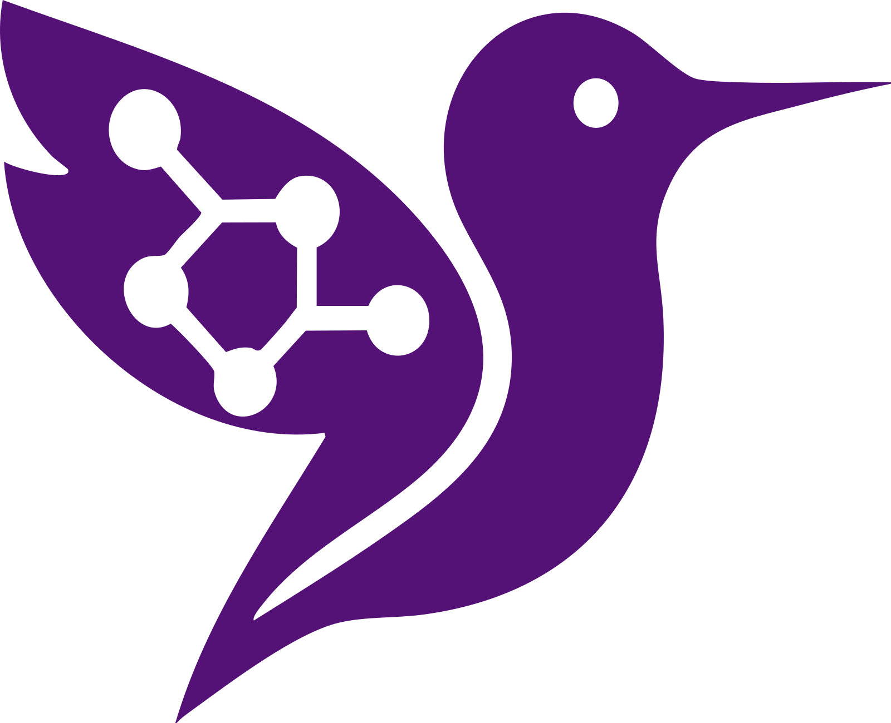
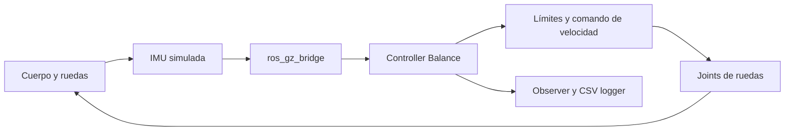

# PerceptIA - Robot autoequilibrado



Modelo digital y banco de pruebas educativo para estudiar un robot autoequilibrado de dos ruedas tipo Tumbller. El repositorio integra una simulación 2D reproducible, un modelo SDF para Gazebo Sim, nodos ROS 2 de control y observación, registro CSV y materiales de clase.

> **Alcance de la evidencia:** las métricas publicadas corresponden a simulaciones incluidas en este repositorio. El modelo Gazebo todavía utiliza parámetros estimados y no existen ensayos físicos versionados del Tumbller.

## Objetivo

Preparar y comparar estrategias de equilibrio antes de probarlas en el robot físico:

- representar el robot como un péndulo invertido sobre dos ruedas;
- observar inclinación y velocidad angular mediante una IMU simulada;
- controlar la velocidad de ambas ruedas con límites de seguridad;
- comparar un PID fijo con un PID adaptativo por mezcla de expertos en 2D;
- registrar telemetría para analizar estabilidad, deriva y esfuerzo de motor;
- ofrecer un entorno Docker reproducible para las estudiantes.

## Arquitectura



### Capas del proyecto

| Capa | Implementación |
|---|---|
| Mecánica simulada | `models/tumbller/model.sdf` y `models/twip_reference/model.sdf` |
| Entorno 3D | Gazebo Sim, mundos en `worlds/` |
| Comunicación | ROS 2 Jazzy y `ros_gz_bridge` |
| Control principal en Gazebo | `scripts/balance_controller.py`, nodo **Controller Balance** |
| Control MoE inicial en Gazebo | `scripts/moe_balance_controller.py`, compuerta heurística |
| Telemetría | `scripts/balance_observer.py` y `scripts/balance_csv_logger.py` |
| Banco rápido 2D | `scripts/sim_2d_pid_ai.py` |
| Material interactivo | archivos HTML y CSV en `docs/` |

## Estrategias de control implementadas

### Controller Balance para Gazebo

`scripts/balance_controller.py` usa una ley de aceleración para mantener el cuerpo vertical y reducir deriva:

```text
a_base = ka·error_angulo + kwa·velocidad_angular
objetivo_angulo = kx·posicion + kv·velocidad
velocidad_rueda = integral(a_base) / radio_rueda
```

El nodo filtra la IMU, aplica zonas muertas cerca de la vertical, limita aceleración y velocidad de rueda, detiene los motores al superar la inclinación de seguridad y limpia su estado cuando Gazebo reinicia el reloj.

Los parámetros están en [`config/pid_params.yaml`](config/pid_params.yaml).

### PID normal frente a PID adaptativo en 2D

`scripts/sim_2d_pid_ai.py` implementa un péndulo invertido no lineal integrado con Runge-Kutta de cuarto orden:

```text
theta_ddot = (g/L)·sin(theta) - (x_ddot/L)·cos(theta) - b·theta_dot
```

- **PID normal:** ganancias fijas `Kp=13.5`, `Ki=0.25`, `Kd=2.25`.
- **PID IA:** mezcla transparente de tres expertos: equilibrio, recuperación y corrección de deriva.
- La compuerta usa `|theta|`, `|theta_dot|` y `|x|` para combinar ganancias.
- Esta versión es heurística; todavía no es una red neuronal ni una política entrenada.

## Resultado reproducible del escenario por defecto

Parámetros: duración `12 s`, paso `0.005 s`, inclinación inicial `7°`, perturbación `-2.5 m/s²` durante `0.12 s` en `t=4 s` y umbral de caída `45°`.

| Métrica simulada | PID normal | PID IA | Interpretación |
|---|---:|---:|---|
| Caída durante 12 s | No | No | Ambos completan el escenario |
| Pico de inclinación | 15.95° | 14.64° | PID IA: 8.2% menor |
| IAE angular | 1.5025 | 1.3484 | PID IA: 10.3% menor |
| Deriva final `|x|` | 0.129 m | 0.094 m | PID IA: 26.6% menor |
| Pico equivalente de motor | 100.9 rpm | 133.3 rpm | PID IA: 32.1% mayor |

La mejora en estabilidad y deriva tiene un costo de mayor esfuerzo máximo de motor. Estos resultados no deben extrapolarse al hardware sin calibración.

## Ejecutar la simulación 2D

Requiere Python 3 y no necesita ROS ni Gazebo:

```bash
python scripts/sim_2d_pid_ai.py
python scripts/create_2d_animation.py
python scripts/create_2d_compendium.py
```

Resultados:

```text
data/sim_2d/pid_vs_pid_ai_2d.csv
data/sim_2d/pid_vs_pid_ai_2d.html
data/sim_2d/pid_vs_pid_ai_2d_animation.html
data/sim_2d/guia_compendio_pid_ia_2d.html
```

Ejemplo con otro escenario:

```bash
python scripts/sim_2d_pid_ai.py --initial-tilt-deg 10 --impulse-accel -3.0 --duration 15
```

## Ejecutar Gazebo con Docker

### Requisitos

- Docker Desktop con backend WSL 2 en Windows, o Docker Engine en Linux.
- WSLg para la interfaz gráfica de Gazebo en Windows.
- Docker Desktop iniciado antes de ejecutar `docker compose`.

### Construir y ejecutar

```bash
docker compose build
docker compose up sim
```

Gazebo con interfaz gráfica desde WSL 2:

```bash
./docker/run-gui-linux.sh
```

Desde PowerShell:

```powershell
.\docker\run-gui-wsl.ps1
```

Entrar al contenedor y lanzar manualmente:

```bash
docker compose run --rm sim bash
ros2 topic list
ros2 launch tumbller_gazebo sim_pid_headless.launch.py
```

## Ejecutar sin Docker

En Ubuntu 24.04 con ROS 2 Jazzy:

```bash
sudo apt update
sudo apt install ros-jazzy-ros-gz ros-jazzy-robot-state-publisher python3-colcon-common-extensions
colcon build --symlink-install
source install/setup.bash
ros2 launch tumbller_gazebo sim_pid.launch.py
```

## Telemetría y archivos de parámetros

Temas principales:

```bash
ros2 topic echo /tumbller/imu
ros2 topic echo /tumbller/odom
ros2 topic echo /joint_states
ros2 topic echo /tumbller/observer/pitch_rad
ros2 topic echo /tumbller/observer/pitch_rate_rad_s
ros2 topic echo /tumbller/observer/base_velocity_m_s
ros2 topic echo /tumbller/observer/left_wheel_speed_rad_s
ros2 topic echo /tumbller/observer/right_wheel_speed_rad_s
```

| Contenido | Ruta |
|---|---|
| Parámetros Controller Balance | [`config/pid_params.yaml`](config/pid_params.yaml) |
| Parámetros iniciales del robot y MoE | [`config/robot_params.yaml`](config/robot_params.yaml) |
| Puente Gazebo - ROS 2 | [`config/bridge.yaml`](config/bridge.yaml) |
| Modelo principal SDF | [`models/tumbller/model.sdf`](models/tumbller/model.sdf) |
| Lanzamientos ROS 2 | [`launch/`](launch/) |
| Controladores | [`scripts/`](scripts/) |
| Registros locales | `data/logs/balance_run_YYYYMMDD_HHMMSS.csv` |
| Material web publicado | [`docs/`](docs/) |

La odometría actual de depuración integra comandos de rueda. No sustituye encoders reales.

## Material para la exposición

- [PowerPoint editable](docs/exposicion/Presentacion_PerceptIA_Robot_Autoequilibrado.pptx)
- [Diapositivas en PDF](docs/exposicion/Diapositivas_PerceptIA_Robot_Autoequilibrado.pdf)
- [Guion de exposición de 10 minutos](docs/exposicion/Guion_Exposicion_Robot_10_min.pdf)
- [README de los entregables](docs/exposicion/README.md)
- [Informe teórico](docs/informe_teorico_pid_ia_robot_auto_balanceado.pdf)
- [Guía para estudiantes](docs/compendio_estudiantes_ejecucion_simulacion.html)
- [Compendio interactivo](docs/guia_compendio_pid_ia_2d.html)

## Página web

- [Portal público del proyecto](https://onlybuzyfm.github.io/Self_Balancing_Robot/)
- [Repositorio en GitHub](https://github.com/onlybuzyfm/Self_Balancing_Robot)

La página carga localmente el SVG de PerceptIA, Roboto y el CSV de la simulación. No depende de una CDN.

## Pruebas y verificación

```bash
python -m py_compile scripts/*.py
python scripts/sim_2d_pid_ai.py
docker compose config
```

La página es estática; puede servirse desde `docs/`:

```bash
python -m http.server 8000 --directory docs
```

Luego abrir `http://localhost:8000/`.

## Limitaciones

- Las masas, inercias, centro de masa, fricción y límites de motor del SDF son estimaciones iniciales.
- La orientación y el signo del comando deben verificarse con el Tumbller físico.
- No hay evidencia versionada de pruebas físicas.
- La mezcla de expertos es una compuerta heurística y no un modelo entrenado.
- El banco 2D simplifica contacto, holguras, saturación eléctrica y dinámica del motor.
- Las pruebas Gazebo requieren revisar geometría y parámetros cuando estén disponibles las medidas reales.

## Siguientes pasos

1. Medir radio y separación de ruedas, masas y altura real del centro de masa.
2. Calibrar la IMU, el signo de los motores y los límites conservadores.
3. Ejecutar perturbaciones repetibles en Gazebo y registrar episodios.
4. Sustituir la odometría integrada por feedback de joints y luego por encoders.
5. Entrenar o ajustar una compuerta de expertos con datos etiquetados.
6. Validar en hardware con interruptor de emergencia y límites bajos de velocidad.

## Seguridad

No probar políticas nuevas directamente en el robot físico sin interruptor de emergencia, soporte mecánico inicial y límites conservadores de motor.
